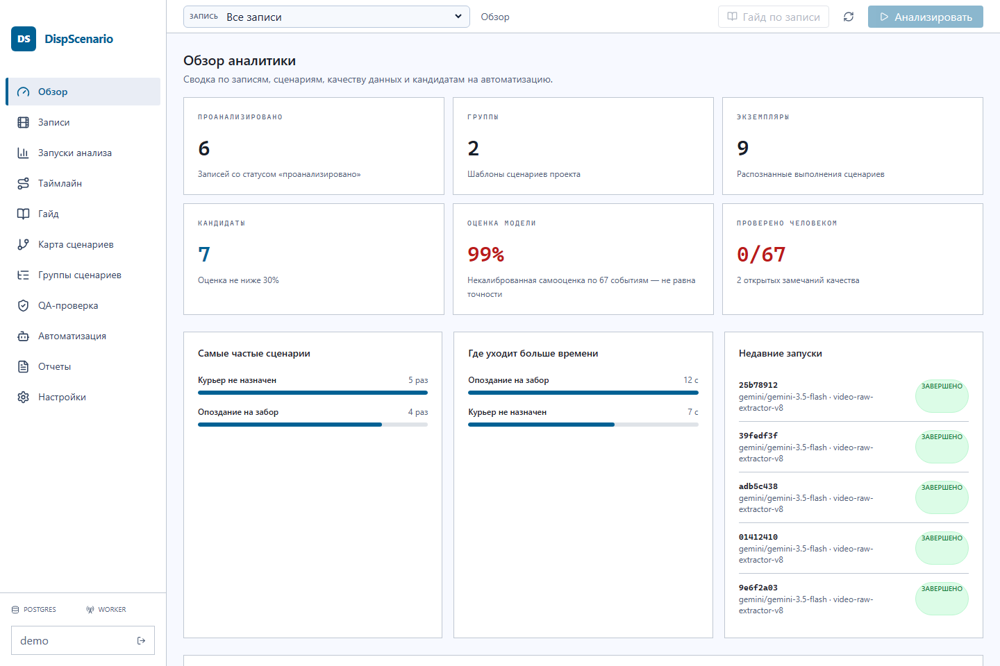
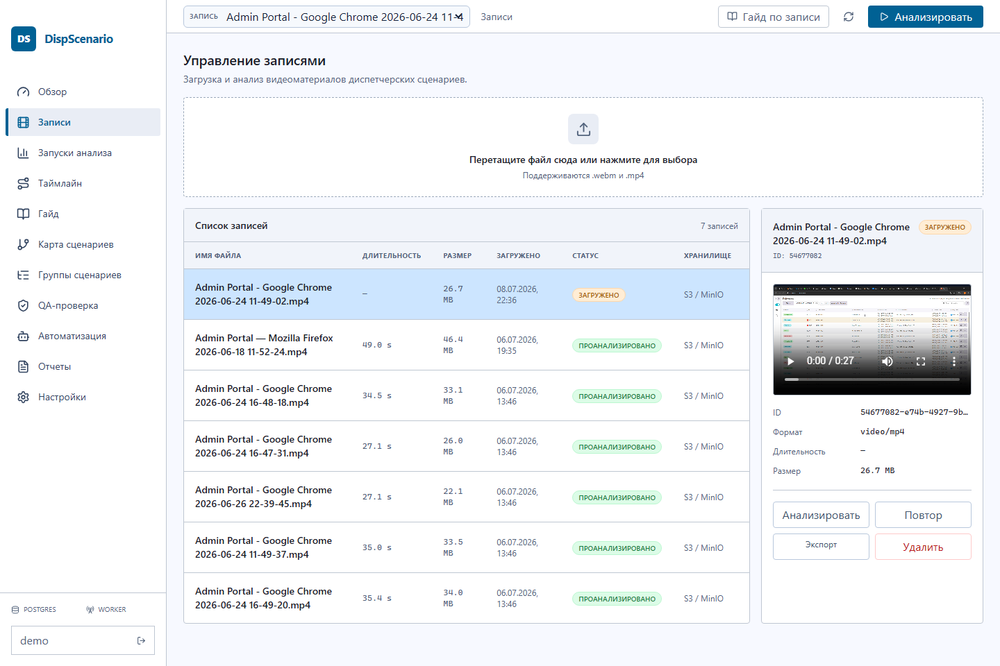
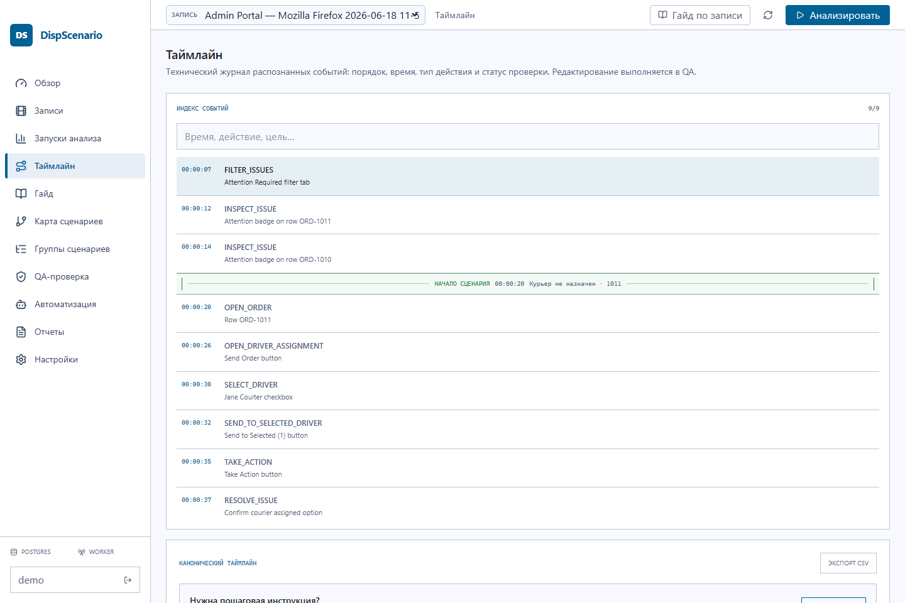
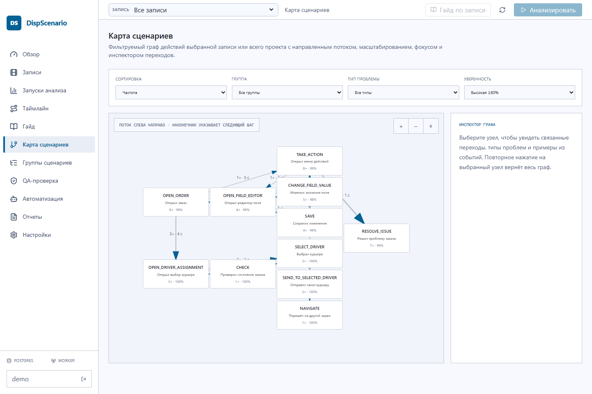
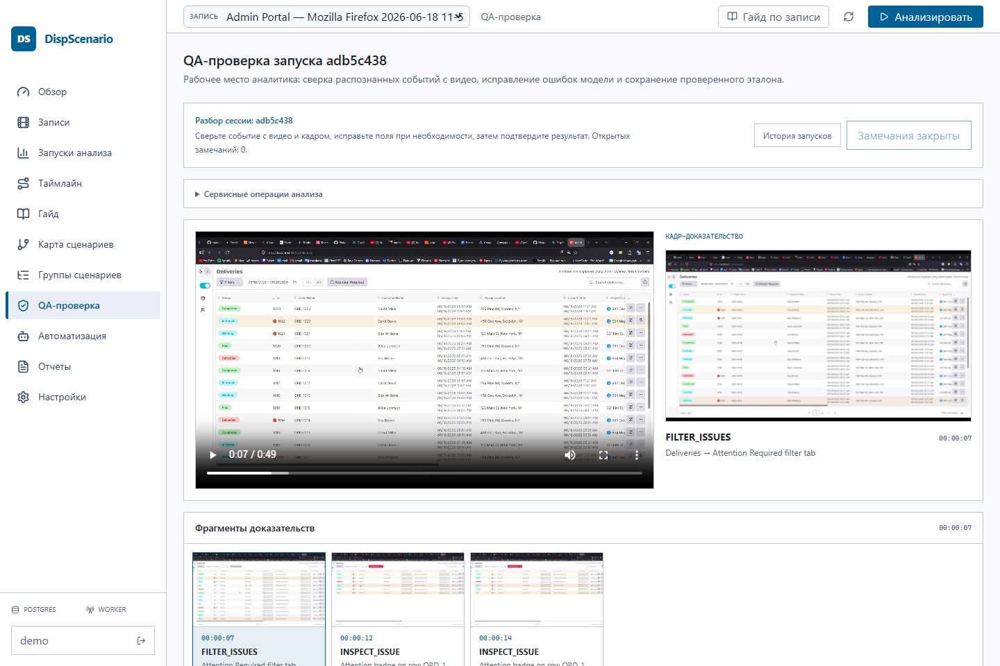
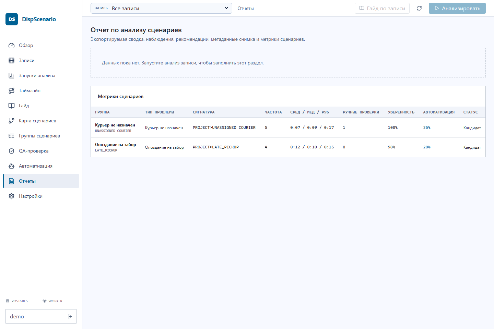

# 🎬 DispScenario Analyst

**DispScenario Analyst** — веб-приложение для анализа видеозаписей диспетчерских сценариев. Оно помогает превратить сырые screen-recording видео в структурированные события, сценарии, QA-замечания, метрики и отчеты.

Проект полезен, когда нужно не просто посмотреть запись, а понять:

- какие действия совершал оператор;
- где сценарий отклонился от ожидаемого процесса;
- какие шаги повторяются чаще всего;
- какие проблемы требуют ручной проверки;
- какие сценарии можно автоматизировать.



## ✨ Что умеет приложение

- 🎥 **Загрузка видеозаписей**: `.webm` и `.mp4`, хранение через S3/MinIO или Backblaze B2.
- 🧠 **AI-анализ через Gemini**: извлечение действий, экранных переходов, событий и подозрительных мест.
- 🧩 **Нормализация событий**: Go pipeline приводит сырые события к единому формату.
- 🗺️ **Карта сценариев**: граф переходов между действиями с частотой, уверенностью и проблемными зонами.
- 🕒 **Таймлайн**: последовательность событий с привязкой ко времени видео.
- 🛡️ **QA-проверка**: ручная валидация спорных фрагментов, проблем качества и границ сценариев.
- 📊 **Отчеты**: сводка по сценариям, метрикам, кандидатам на автоматизацию и CSV-экспортам.
- ⚙️ **Настройки Gemini**: персональный ключ можно сохранить в интерфейсе; он шифруется в PostgreSQL.
- 📡 **Production-like observability**: Prometheus, Grafana, Loki, Alloy, backup/restore и smoke-тесты.

## 🖼️ Интерфейс

### Записи и загрузка

Страница записей показывает все видео, статусы анализа, размер, длительность, превью и действия: анализ, повтор, экспорт, удаление.



### Таймлайн событий

Таймлайн помогает проверить порядок действий и быстро найти место в видео, где появился конкретный шаг сценария.



### Карта сценариев

Граф показывает частые переходы между действиями и помогает найти устойчивые сценарии, развилки и точки для автоматизации.



### QA-проверка

QA-экран нужен для ручного контроля качества: спорные события, границы сценариев, проблемы распознавания и исправления.



### Отчеты

Отчеты собирают результаты анализа в прикладной вид: сценарии, частотность, длительность, качество данных и экспорт.



## 🧭 Как это работает

```text
Видео → S3/MinIO → Go API → очередь задач → worker / postgres runner
      → Gemini → сырые события → нормализация → сценарии → QA → отчеты
```

1. Пользователь загружает запись через frontend.
2. Backend выдает signed URL и сохраняет метаданные в PostgreSQL.
3. Анализ запускается как фоновая задача.
4. Gemini извлекает действия из видео.
5. Go pipeline нормализует события, строит сценарии и метрики.
6. UI показывает записи, таймлайн, карту сценариев, QA и отчеты.

## 🧱 Технологии

| Слой | Стек |
| --- | --- |
| Frontend | Next.js, React, TypeScript, Tailwind CSS |
| Backend | Go API, OpenAPI strict server, PostgreSQL runner |
| AI | Gemini video analysis |
| Очереди | Redis/Asynq локально, PostgreSQL backend на Render |
| Данные | PostgreSQL |
| Файлы | S3-compatible storage: MinIO локально, Backblaze B2 в облаке |
| Observability | Prometheus, Grafana, Loki, Alloy |
| Тесты | Vitest, Playwright, Go tests, integration tests |
| Инфраструктура | Docker Compose, Render Blueprint |

## 📁 Структура проекта

```text
analyst-app-v2/
├── api/                    # OpenAPI contract
├── backend/                # Go API, worker, migrations, domain pipeline
│   ├── cmd/                # api, worker, migration utilities
│   ├── internal/           # business logic, storage, jobs, vision, auth
│   └── migrations/         # PostgreSQL migrations
├── frontend/               # Next.js dashboard
│   ├── src/app/            # App Router pages and API proxy routes
│   ├── src/features/       # recordings, QA, reports, auth, events
│   └── src/lib/            # API clients, session, backend proxy
├── docs/                   # runbooks, audits, screenshots
├── infra/                  # S3 CORS and infrastructure helpers
├── scripts/                # backup, restore, E2E and verification scripts
├── tests/                  # fixtures and E2E assets
├── docker-compose.yml      # local full-stack environment
├── render.yaml             # Render deployment blueprint
└── Makefile                # common development commands
```

## 🚀 Быстрый запуск через Docker Compose

### 1. Требования

- Docker Desktop с Compose v2.
- 6+ GB свободной памяти.
- PowerShell для Windows-команд.
- Gemini API key, если нужен реальный AI-анализ.

### 2. Создать `.env`

```powershell
Copy-Item .env.example .env
```

Минимально для локального запуска можно оставить значения из `.env.example`. Для реального анализа добавьте:

```dotenv
GEMINI_API_KEY=your_gemini_key
```

Для сохранения персональных Gemini-ключей в UI лучше также задать:

```dotenv
CREDENTIALS_ENCRYPTION_KEY=long-random-secret
```

### 3. Поднять весь стек

```powershell
docker compose up -d --build
docker compose ps
```

### 4. Открыть сервисы

- 🌐 Frontend: `http://localhost:3000`
- ❤️ API health: `http://localhost:8787/health`
- 🗂️ MinIO console: `http://localhost:9001`
- 📈 Prometheus: `http://localhost:9090`
- 📊 Grafana: `http://localhost:3001` (`admin` / `analyst`)

## 🧪 Разработка

Установить frontend-зависимости:

```powershell
cd frontend
npm install
```

Запустить frontend отдельно:

```powershell
npm run dev
```

Частые команды из корня проекта:

```powershell
make generate
make test
make lint
make security
make verify-no-js
```

Frontend-команды:

```powershell
cd frontend
npm run lint
npm test
npm run build
npm run test:e2e
```

Backend-команды:

```powershell
cd backend
go test ./...
go test -race ./...
```

Если Go не установлен локально, `Makefile` запускает Go-команды через Docker-образ.

## ✅ Тестирование и качество

Проект проверяет несколько уровней:

- unit-тесты frontend через Vitest;
- Go unit/integration tests;
- OpenAPI generation и contract checks;
- Playwright E2E;
- full-stack E2E с загрузкой видео, S3, Redis/Asynq, Gemini и отчетами;
- `govulncheck`, `staticcheck`, `golangci-lint`;
- проверка, что исходные `.js/.jsx/.cjs/.mjs` файлы не используются.

Полный E2E:

```powershell
make test-e2e-full
```

## 🔐 Авторизация

Локально по умолчанию:

```dotenv
AUTH_DISABLED=true
```

В таком режиме API создает development principal с ролями `admin`, `analyst`, `viewer`.

Для OIDC:

```dotenv
AUTH_DISABLED=false
OIDC_ISSUER=https://identity.example.com/
OIDC_CLIENT_ID=dispscenario-analyst
```

На Render frontend использует demo login через `DEMO_USERNAME`, `DEMO_PASSWORD` и signed HttpOnly session cookie. Основной Go API защищается shared secret между frontend и API.

## ☁️ Деплой на Render

В репозитории есть `render.yaml` для occasional-use деплоя.

Текущая схема:

- `disp-scenario-web` — Next.js frontend и локальный Go API в одном контейнере.
- `disp-scenario-api` — отдельный API-сервис как fallback/debug endpoint.
- Neon хранит PostgreSQL.
- Backblaze B2 хранит видео и evidence frames.

Почему web и API объединены в одном Render web service: на free plan отдельные сервисы засыпают, и пользователю приходилось ждать два cold start. Теперь открытие frontend будит контейнер, внутри которого сразу есть локальный API на `127.0.0.1:8787`.

Ключевые переменные для `disp-scenario-web`:

```dotenv
DATABASE_URL=
S3_ENDPOINT=
S3_PUBLIC_ENDPOINT=
S3_ACCESS_KEY=
S3_SECRET_KEY=
S3_BUCKET=
S3_REGION=
API_SHARED_SECRET=
CREDENTIALS_ENCRYPTION_KEY=
GEMINI_API_KEY=
DEMO_USERNAME=
DEMO_PASSWORD=
AUTH_SESSION_SECRET=
RUN_MIGRATIONS=false
```

Миграции выполняет отдельный `disp-scenario-api`, а web-сервис стартует быстро и не блокирует port scan Render.

Проверка режима backend:

```text
https://disp-scenario-web.onrender.com/api/backend-health
```

Ожидаемый ответ:

```json
{
  "backendMode": "local",
  "localApiConfigured": true,
  "backendApiUrl": "http://127.0.0.1:8787",
  "status": 200
}
```

## 💾 Backup / Restore

Создать backup:

```powershell
./scripts/backup.ps1
```

Проверить backup:

```powershell
./scripts/verify-backup-restore.ps1 -ManifestFile ./backups/manifest-<timestamp>.json
```

Восстановить данные:

```powershell
./scripts/restore.ps1 `
  -ManifestFile ./backups/manifest-<timestamp>.json `
  -ConfirmDataReplacement
```

Backup включает PostgreSQL dump, архив MinIO volume и manifest с SHA-256 checksums.

## 🛠️ Частые проблемы

### Записи не грузятся на Render

Проверьте:

```text
https://disp-scenario-web.onrender.com/api/backend-health
```

Если `backendMode` не `local`, значит web-сервис не видит backend env-переменные или запущен старый деплой.

### Gemini-анализ не стартует

Проверьте:

- `GEMINI_API_KEY` в `.env` или сохраненный персональный ключ в UI;
- `CREDENTIALS_ENCRYPTION_KEY`, если ключ сохраняется через настройки;
- статус job runner в `/health`.

### Видео не открывается

Проверьте:

- `S3_ENDPOINT` и `S3_PUBLIC_ENDPOINT`;
- CORS на bucket;
- доступность MinIO/Backblaze;
- что объект реально существует в bucket.

### Docker Compose долго стартует

Первый запуск собирает frontend, backend, worker и инфраструктурные сервисы. Обычно помогает:

```powershell
docker compose ps
docker compose logs api
docker compose logs frontend
```

## 📌 Для чего проект

DispScenario Analyst закрывает разрыв между “у нас есть видео работы оператора” и “у нас есть проверяемая модель процесса”. Он нужен для анализа сценариев, поиска узких мест, подготовки QA-разметки и отбора кандидатов на автоматизацию.

Итоговый артефакт — не просто запись экрана, а набор событий, сценариев, проблем качества, метрик и отчетов, которые можно обсуждать с аналитиками, QA и командой автоматизации.
